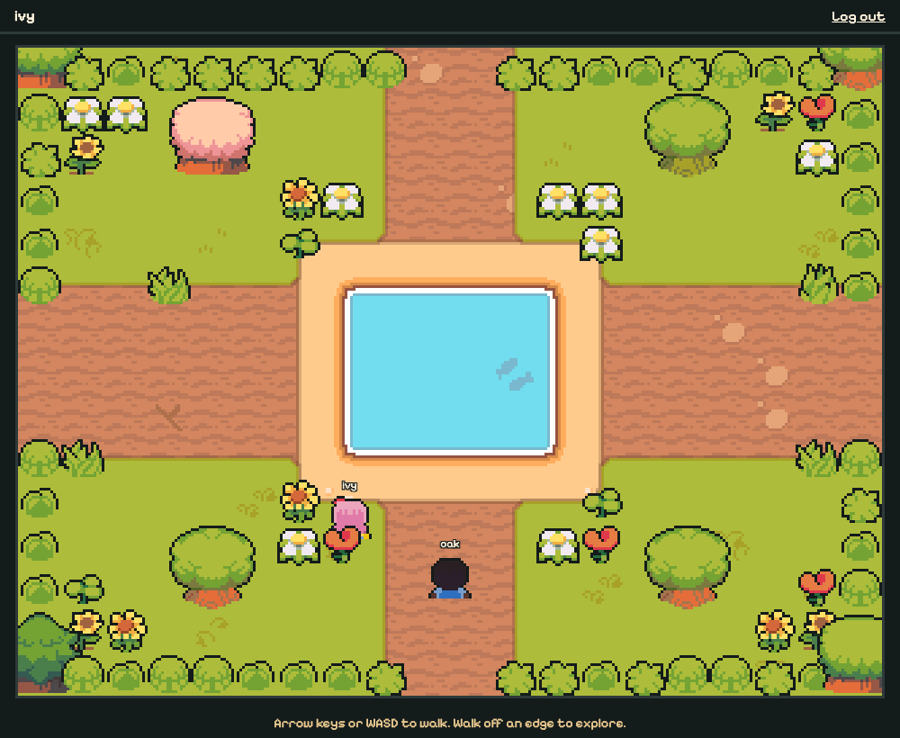

# Geekity Explore

A shared top-down pixel-art world. Sign up, design an avatar, and start in the secret garden. The world is a grid of screens that do not exist until someone walks onto them. Every screen is a pure function of the world's seed and its position, so it matches its neighbours whatever order they appear in, and it is saved for everyone once generated. Players on the same screen see each other move.



## Requirements

- Node 24 (see `.nvmrc`)
- pnpm 12 (`corepack enable`)

## Setup

```sh
pnpm install
pnpm dev
```

`pnpm dev` runs the server on port 3000 and the Vite dev server, which proxies `/api` and `/ws` to it. Open the URL Vite prints.

For a production-style run, build the client and start the server, which serves the built client:

```sh
pnpm build
pnpm start
```

Behind a reverse proxy, set `TRUST_PROXY=true` so login and signup rate limits key on the client address the proxy reports in `X-Forwarded-For` (the rightmost entry, the one the proxy itself appended) instead of the proxy's own address. Leave it unset when the server is reachable directly.

## Scripts

| Script                                | What it does                                                                                                                                                                                |
| ------------------------------------- | ------------------------------------------------------------------------------------------------------------------------------------------------------------------------------------------- |
| `pnpm dev`                            | Server with watch mode, plus the Vite dev server                                                                                                                                            |
| `pnpm build`                          | Build every package that has a build step                                                                                                                                                   |
| `pnpm start`                          | Start the server                                                                                                                                                                            |
| `pnpm lint`                           | ESLint with type-aware rules                                                                                                                                                                |
| `pnpm format` / `pnpm format:check`   | Prettier write or check                                                                                                                                                                     |
| `pnpm typecheck`                      | `tsc` in every package                                                                                                                                                                      |
| `pnpm test`                           | Vitest across all packages                                                                                                                                                                  |
| `pnpm e2e`                            | Playwright end-to-end tests against a fresh server, in the installed Chrome                                                                                                                 |
| `pnpm world:wipe --yes`               | Delete the generated world and saved positions (accounts stay), roll a new world seed, and restore the garden. Stop the server first. Uses `DB_PATH`, default `apps/server/data/explore.db` |
| `pnpm --filter @explore/core preview` | Render a large area of the world to a PNG for tuning generation                                                                                                                             |

## Layout

- `packages/core` holds the pure game logic shared by server and client: world model, generation, collision, avatar model, and protocol schemas.
- `apps/server` is the Hono server with SQLite storage and WebSocket presence. It runs TypeScript directly through Node's type stripping.
- `apps/web` is the Vite and Canvas 2D client.

The art is the CC0 [Ninja Adventure](https://pixel-boy.itch.io/ninja-adventure-asset-pack) pack by pixel-boy. See `apps/web/public/assets/ninja-adventure/SOURCES.md`. With the dev server running, `/art.html` shows every terrain transition, feature, and avatar combination.

## Tuning world generation

The preview renders a large area of the world straight from a seed as a PNG, without a server or database. Use it to check generation changes by eye before you play them.

```sh
pnpm --filter @explore/core preview -- --seed 1 --area -16,-16,32,32 --out world.png
```

| Option                  | Default             | What it sets                                                    |
| ----------------------- | ------------------- | --------------------------------------------------------------- |
| `--seed <n>`            | `1`                 | World seed                                                      |
| `--area <x0,y0,w,h>`    | `-16,-16,32,32`     | North-west screen and size in screens; the garden is at `0,0`   |
| `--mode terrain\|biome` | `terrain`           | Colour tiles by terrain or by biome                             |
| `--overlay roads,pois`  | none                | Draw roads and points of interest on top                        |
| `--scale <px>`          | `1`                 | Pixels per tile; features show as marks from 4                  |
| `--grid`                | off                 | Faint lines on screen borders                                   |
| `--out <file.png>`      | `world-preview.png` | Output path, relative to the directory you ran the command from |

The same arguments always produce the same file, so you can compare two renders before and after a change. The command prints the colour legend and the area it drew. Biome mode colours each tile by the biome at its centre, with the garden in pink. The tool renders from a `WorldSource` in `packages/core/scripts/world-source.ts`. The current source generates each screen straight from the world seed, so any area renders the same screens the game would.

Design notes and decisions live in `backlog/docs`. Tasks live in `backlog/tasks`.

## Releases

Commits follow [Conventional Commits](https://www.conventionalcommits.org). release-please opens a release PR from them on every push to `main`.
